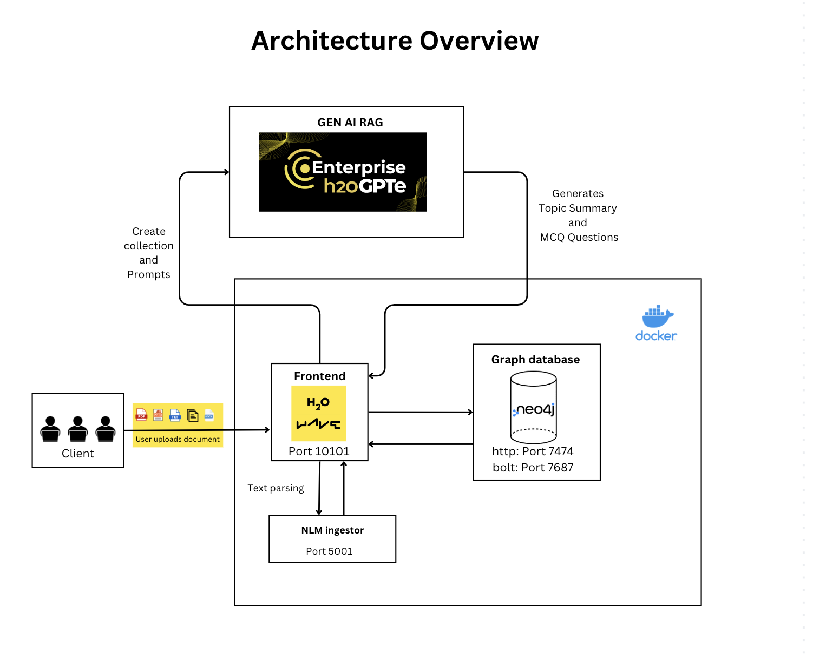

# 🎓  Group group's DSA4213 Project: AcademIQ 


<div align='center'>


Introducing AcademIQ - your personal exam assistant designed to simplify your study experience and maximize your academic success. Simply upload any document and watch AcademIQ easily generate summaries and practice MCQ questions based on the different topics present in the documents. This app is suitable for both students and educators.
</div>

# 🏛️ Solution Architecture


# 📁 File Structure

**app.py** - Coding file containing the web application built using the H2O Wave framework. The application allows users to upload files (PDF, Word, PowerPoint, text, and Markdown) and generate a knowledge graph from the content of those files. Additionally, it provides a question generation feature based on selected topics from the knowledge graph. This file is executed to run the application, which will be accessible through a web browser at the specified URL.

**db.py** - A module for interacting with a Neo4j database to store and retrieve the knowledge graph. It provides functions to initialise the database, insert topics and documents, create relationships between them, and retrieve structured data about the topics and documents stored within the database.

**h2ogpt.py** - A module for extracting topics, generating questions, and interacting with a language model (LLM).

**preprocessing.py** - A module for parsing the uploaded files.

**docker-compose.yml** - Specifies the images required for Docker Compose, the ports they need to expose, whether they have access to the host filesystem, what commands should be run when they start up etc.

**Dockerfile** - A text document containing all the commands the user requires to call on the command line to assemble an image.

# 🛠️ Tech stack

1.**Neo4j**
   - Graph Database Management System
   - Fast, secure and scalable native graph database used to manage and query graph data . It uses graph structures with nodes, relationships, and properties to represent and store data.

2 **Docker**
   - Containerization Platform
   - Platform that allows you to package, distribute, and run applications in isolated containers. It provides a consistent environment for applications to run, making it easier to deploy and manage software across different environments.

3.**H2O Wave**
   - Web Application Framework
   - Python-based web application framework that simplifies the development of interactive data-driven applications. It provides tools for building interactive user interfaces (frontend)

4.**H2OGPTE**
   - Retrieval-Augmented Generation (RAG) Framework
   - Pairs information retrieval with a set of carefully designed system prompts to anchor LLMs on precise, up-to-date, and important information retrieved from an external data store.

# 🚀 Development Guide
## Getting Started

Ensure Docker is installed and running on your device.

Run the below command to start AcademIQ:

```sh
docker compose up -d
```

Head over to <http://localhost:10101> to start uploading.

## To Set Up A Development Server / To Edit On Wave App

Create a python environment by running the following command (this is assuming Python is installed properly).


For MacOS / Linux:

```sh
python3 -m venv venv
source venv/bin/activate
pip install -r requirements.txt
```

For Windows:

```sh
python3 -m venv venv
venv\Scripts\activate
pip install -r requirements.txt
```


Once the virtual environment is setup and active, run the below command to start the app:

```sh
wave run app.py
```

A Wave app will start at <http://localhost:10101>.

## Dependencies

This app depends on external services that are defined in `docker-compose.yml`. Some of these
services will need to run during development. They include:

- `db.py` and `upload_files()` in `app.py` which relies on neo4j
- `preprocessing.py` and `upload_files()` in `app.py` which relies on nlm_ingestor

Ensure the respective services are up and running using docker compose:

```sh
docker compose up -d <service_name>
```

## Testing

To run tests for specific files, run the command:

```sh
pytest <filename>
```

This will run the test functions prefixed with `test_` in the file.


# 📘 User Guide

Upload files by clicking on the *'Browse'* button in the Upload Files widget located on the left. Alternatively, files can be dragged and dropped within that area to be uploaded. File types that can be uploaded include PDF, Word Document (.docx), Powerpoint Presentation (.pptx), Text Files (.txt) and Markdown Files (.md).

Once the page has finished loading, the files have uploaded successfully and the knowledge graph can be viewed when the page is scrolled downwards.

In the graph, the red nodes represent the files uploaded while the blue nodes branching out from them represent the topics present in the respective files. Hover over the nodes to find out the different topics present. The nodes can also be easily dragged around.

To view the summaries generated by AcademIQ, click on the selected blue nodes one time and the name of the topic will appear under *'Topic(s) Selected:'* section located above the graph. The summaries of the topics selected will appear at the bottom of the page, below the graph. To unselect a topic, simply click on the selected blue nodes again.

To generate MCQ questions, select the topics you want to generate questions for and head over to the *'Question Generation'* tab. Click on the *'Generate'* button.

Once the page has finished loading, multiple MCQ questions relevant to the topics selected will appear. 

To verify answers, scroll the page down to the chatbot and input your answers to the questions in the form of 'Question Number: Option Number' e.g., "Question 1: 3" or "For question 1, my answer is option 3." The chatbot will then check if the input answer is correct and provide an explanation.

# 🐞 Common Issues

- Error running H2O Wave on Docker for mac. \
https://github.com/h2oai/wave/issues/2309
- For the usage of file upload and question generation, you may encounter errors. This is due to the Mixtral LLM providing truncated JSON outputs. We experimented with a few models, namely *mistral-large-latest*, *mistralai/Mixtral-8x7B-Instruct-v0.1*, and *mistral-medium*. We found that *mistral-large-latest* worked the best for our use case.
 \
https://github.com/vllm-project/vllm/issues/2464 \
https://huggingface.co/mistralai/Mixtral-8x7B-Instruct-v0.1/discussions/182
- Knowledge graph not displayed immediately after upload files. As a workaround, we can either refresh the page, or click on the *'Question Generation'* tab before returning to the *'Knowledge Graph'* tab.